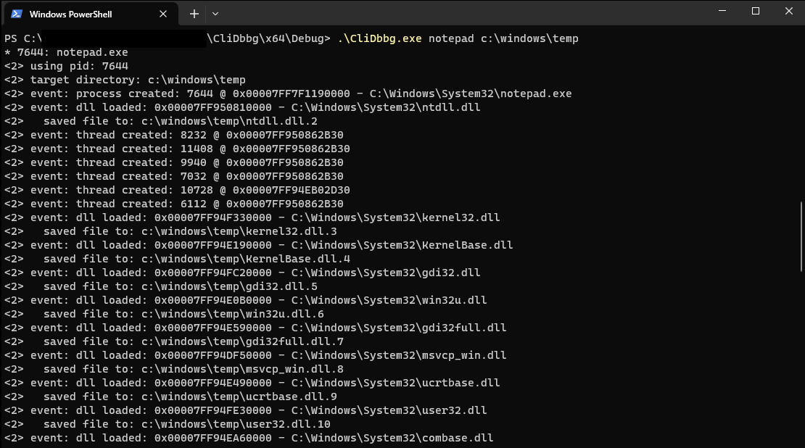

## CliDbbg

Simple CLI Windows debugger. Capable of copying loaded images into a dump directory.

## Usage
Specific pid, no save:
```
clidbbg.exe 713
```

Use first pid matching `*notepad*` and dump into temp:
```
clidbbg.exe notepad c:\windows\temp
```



## Creds
- [Writing a basic Windows debugger part 1](https://www.codeproject.com/Articles/43682/Writing-a-basic-Windows-debugger) and [part 2](https://www.codeproject.com/Articles/132742/Writing-Windows-Debugger-Part-2), by Ajay Vijayvargiya
- Microsoft Learn: [Obtaining a File Name From a File Handle](https://learn.microsoft.com/en-us/windows/win32/memory/obtaining-a-file-name-from-a-file-handle)

## Never previously asked questions
- Why is it called CliDbbg instead of CliDbg?  
  Splelling mistake.
